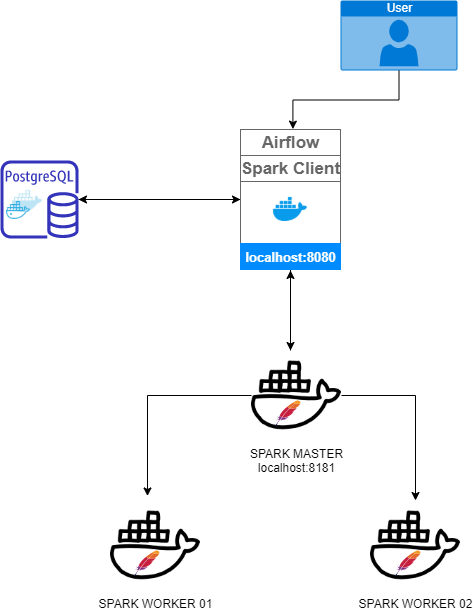

# End-to-End Pipeline using Apache `Airflow`, `Spark` and `Docker`


## Getting Started:

```sh
$ docker-compose up --build
```
        Airflow: http://localhost:8282
        Spark Master: http://localhost:8181


## Prerequisite
`spark_default` must be specified before running DAG, it can be configured via Web UI
Goto: Admin -> Connections
```
         Host: spark://spark
         Port: 7077
```

## Architecture


